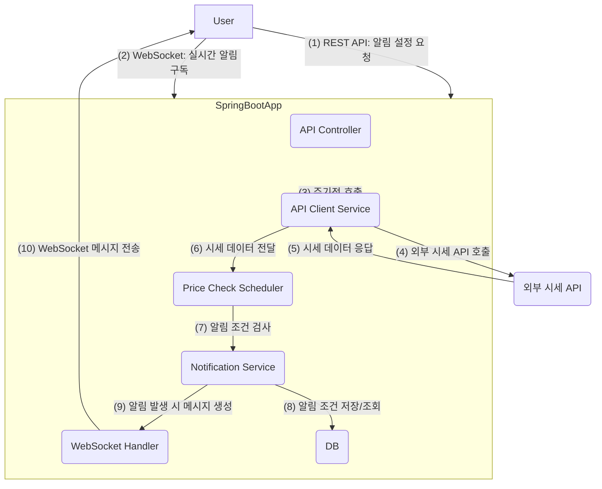

📈 Realtime Stock/Crypto Notifier (Spring Boot)

🚀 프로젝트 소개
본 프로젝트는 실시간 주식/코인 시세 알림 서비스의 백엔드 시스템입니다. 외부 시세 API로부터 특정 종목의 현재 가격 데이터를 주기적으로 수집하고, 사용자가 설정한 알림 조건(예: 특정 가격 도달, 가격 변동률 임계치 초과)이 충족되면 WebSocket을 통해 해당 사용자에게 실시간으로 알림을 전송합니다.
이는 백엔드 개발자로서 실시간 데이터 처리, 외부 API 연동, 비동기 통신 (WebSocket), 스케줄링, 그리고 RESTful API 설계 역량을 보여주기 위한 프로젝트입니다.

✨ 주요 기능
- **실시간 시세 데이터 수집**: 외부 주식/코인 API (예: Upbit Open API)를 주기적으로 호출하여 최신 시세 정보를 가져옵니다.
- **사용자 알림 설정 (REST API)**: 사용자는 REST API를 통해 알림을 받고 싶은 종목(market, targetValue, conditionType, operator) 등을 설정할 수 있습니다.
  - **API Endpoints**:
    - `POST /api/notifications`: 새로운 알림 설정 등록
    - `GET /api/notifications`: 등록된 알림 목록 조회
    - `DELETE /api/notifications/{id}`: 특정 알림 삭제
- **실시간 알림 전송 (WebSocket)**: 백엔드에서 주기적으로 시세를 확인하고, 사용자 설정에 맞는 알림 조건이 충족되면 연결된 WebSocket 클라이언트에게 즉시 알림 메시지를 전송합니다.
  - WebSocket Endpoint: `/ws/notifications` (STOMP 사용 시)
- **데이터 스케줄링**: `@Scheduled` 어노테이션을 사용하여 정해진 간격(예: 1초, 5초)으로 시세 데이터를 업데이트하고 알림 조건을 검사합니다.

🛠️ 기술 스택
- **언어**: Java 17
- **프레임워크**: Spring Boot 3.x
- **빌드 툴**: Maven (또는 Gradle)
- **데이터베이스 (선택)**: H2 Database (개발용), MySQL/PostgreSQL (운영용) - 사용자의 알림 설정 정보를 저장
- **API 통신**: Spring RestTemplate 또는 WebClient
- **실시간 통신**: Spring WebSocket (STOMP 또는 Low-level API)
- **보안**: Spring Security (간단한 웹소켓 및 API 보안 설정)
- **테스트**: JUnit 5, Mockito
- **코드 관리**: Git
- **문서화**: Markdown (README.md)

⚙️ 아키텍처 다이어그램


**아키텍처 설명**
- **사용자 (User)**: 웹 인터페이스를 통해 백엔드에 알림 설정을 등록하거나 실시간 알림을 구독합니다.
- **Spring Boot Application**:
  - **Controller**: 알림 설정을 위한 REST API를 처리합니다.
  - **WebSocket Handler**: WebSocket 연결을 관리하고, 실시간 알림 메시지를 클라이언트에게 전송합니다.
  - **Price Check Scheduler**: `@Scheduled` 어노테이션을 사용하여 주기적으로 외부 시세 API를 호출하고 알림 조건을 검사합니다.
  - **API Client Service**: 외부 주식/코인 시세 API와 통신하여 데이터를 가져옵니다.
  - **Notification Service**:
    - 사용자의 알림 설정을 관리하고, DB에 저장합니다.
    - 스케줄러로부터 받은 시세 데이터를 기반으로 알림 조건을 검사합니다.
    - 조건이 충족되면 WebSocket을 통해 전송될 알림 메시지를 생성합니다.
  - **Notification Repository**: JPA를 통해 알림 설정 정보를 데이터베이스에 저장하고 조회합니다.
- **External API**: 실제 주식/코인 시세 데이터를 제공하는 외부 서비스입니다.

🏃‍♂️ 시작하기

📋 **사전 준비**
1. Java Development Kit (JDK) 17 이상 설치
2. Maven 또는 Gradle 설치 (본 프로젝트는 Maven을 사용합니다.)
3. IntelliJ IDEA 또는 VS Code와 같은 IDE

🌐 **외부 API Key (필요시)**
프로젝트에서 사용할 외부 주식/코인 시세 API (예: Upbit, Binance)의 API Key가 필요할 수 있습니다. `application.yml` 파일에 설정합니다.

```yaml
# src/main/resources/application.yml
api:
  upbit:
    base-url: https://api.upbit.com/v1
    # access-key: your_access_key (필요시)
    # secret-key: your_secret_key (필요시)
```

📦 **프로젝트 설정 및 실행**
1. 리포지토리 클론:
   ```bash
   git clone https://github.com/your-username/realtime-stock-crypto-notifier.git
   cd realtime-stock-crypto-notifier
   ```
2. 의존성 설치 (Maven 예시):
   ```bash
   mvn clean install
   ```
3. 애플리케이션 실행:
   - IDE에서 `RealtimeStockCryptoNotifierApplication.java` 파일을 실행하거나,
   - 터미널에서 Maven으로 실행:
     ```bash
     mvn spring-boot:run
     ```
   애플리케이션은 기본적으로 [http://localhost:8080](http://localhost:8080) 에서 실행됩니다.

🧪 **테스트 방법**
- Postman/Insomnia 등으로 REST API 테스트:
  - 알림 설정 등록 (POST): `http://localhost:8080/api/notifications`
    ```json
    {
        "market": "KRW-BTC",
        "targetValue": 50000000.0,
        "conditionType": "PRICE_REACHED",
        "operator": "GREATER_THAN"
    }
    ```
  - 알림 목록 조회 (GET): `http://localhost:8080/api/notifications`
- 간단한 HTML/JavaScript 클라이언트로 WebSocket 테스트:
  `src/main/resources/static/index.html` 파일을 열고, 웹소켓 연결 및 메시지 수신 테스트를 진행합니다. (간단한 예시 코드 포함)

```html
<!DOCTYPE html>
<html>
<head>
    <title>WebSocket Test Client</title>
    <script src="https://cdn.jsdelivr.net/npm/sockjs-client/dist/sockjs.min.js"></script>
    <script src="https://cdn.jsdelivr.net/npm/stompjs/lib/stomp.min.js"></script>
</head>
<body>
    <h1>Realtime Notification Test</h1>
    <button onclick="connect()">Connect WebSocket</button>
    <button onclick="disconnect()">Disconnect WebSocket</button>
    <pre id="messages"></pre>
    <script>
        let stompClient = null;
        function connect() {
            const socket = new SockJS('/ws/notifications');
            stompClient = Stomp.over(socket);
            stompClient.connect({}, function (frame) {
                console.log('Connected: ' + frame);
                document.getElementById('messages').innerText += 'Connected to WebSocket.\n';
                stompClient.subscribe('/topic/price_updates', function (message) {
                    const parsedMessage = JSON.parse(message.body);
                    document.getElementById('messages').innerText += 'Received Price Update: ' + JSON.stringify(parsedMessage, null, 2) + '\n';
                });
                stompClient.subscribe('/user/queue/notifications', function (message) {
                    const parsedMessage = JSON.parse(message.body);
                    document.getElementById('messages').innerText += 'Received Notification: ' + JSON.stringify(parsedMessage, null, 2) + '\n';
                });
            }, function(error) {
                console.error('STOMP Error: ' + error);
                document.getElementById('messages').innerText += 'WebSocket Error: ' + error + '\n';
            });
        }
        function disconnect() {
            if (stompClient !== null) {
                stompClient.disconnect();
            }
            console.log('Disconnected');
            document.getElementById('messages').innerText += 'Disconnected from WebSocket.\n';
        }
    </script>
</body>
</html>
```

🌟 **프로젝트를 통해 얻을 수 있는 경험**
- Spring Boot 기반 백엔드 애플리케이션 개발: Spring MVC, Spring Data JPA, Spring Security 등 핵심 Spring 기술 활용
- RESTful API 설계 및 구현: HTTP 메소드, 상태 코드, 데이터 모델링 등 REST API 모범 사례 적용
- 실시간 통신 이해: WebSocket의 동작 원리 및 Spring WebSocket을 이용한 구현
- 외부 API 연동: RestTemplate 또는 WebClient를 이용한 외부 서비스와의 데이터 연동
- 데이터 스케줄링: `@Scheduled` 어노테이션을 활용한 주기적 작업 처리
- 비동기 처리: 실시간 데이터 처리의 중요한 요소인 비동기 프로그래밍 개념 이해
- DDD (Domain Driven Design) 기초: controller, service, repository 등 레이어 아키텍처 적용
- TDD/단위 테스트: JUnit과 Mockito를 활용한 테스트 코드 작성 경험 (초보자는 간단하게라도 시도)
- 버전 관리 (Git): 체계적인 커밋 메시지와 브랜치 전략을 통한 협업 능력 향상

💡 **향후 개선 방향 (선택 사항)**
- 인증/인가 기능 추가: Spring Security를 활용하여 JWT 기반 사용자 인증 및 권한 관리 추가
- 메시지 큐 도입: Kafka 또는 RabbitMQ를 도입하여 시세 데이터 수집과 알림 전송을 비동기적으로 분리, 시스템 확장성 및 견고성 증대
- Dockerize: 프로젝트를 Docker 컨테이너로 패키징하여 배포 용이성 확보
- 클라우드 배포: AWS EC2, GCP Compute Engine 등에 배포하여 클라우드 환경 경험
- 모니터링: Prometheus, Grafana 등을 연동하여 시스템 상태 및 성능 모니터링
- 성능 최적화: DB 인덱싱, 캐싱(Redis), 동시성 제어 등 성능 개선 방안 적용
- Frontend 연동: React, Vue.js, Angular 등을 사용하여 실제 알림을 시각적으로 보여주는 UI 개발
- 다양한 알림 조건: 매수/매도 호가, 거래량 등 더 복잡한 알림 조건 추가
- 사용자별 구독 관리: 각 사용자에게 필요한 종목만 실시간으로 구독하도록 최적화

🤝 **기여자**
- [본인의 GitHub ID] - 초기 개발 및 핵심 기능 구현

📜 **라이선스**
이 프로젝트는 MIT 라이선스를 따릅니다. 자세한 내용은 LICENSE 파일을 참조하세요.
